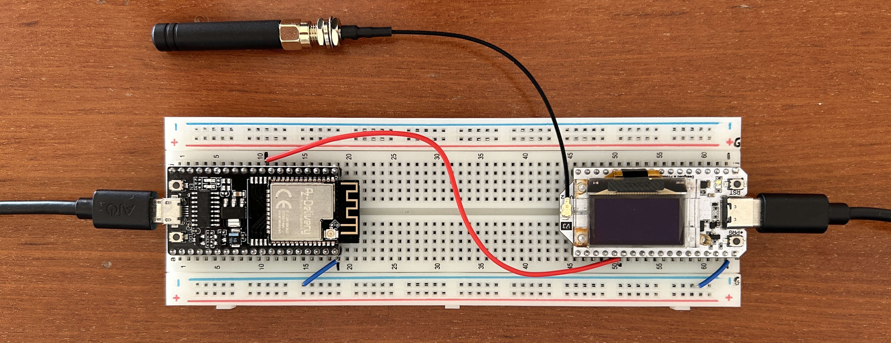
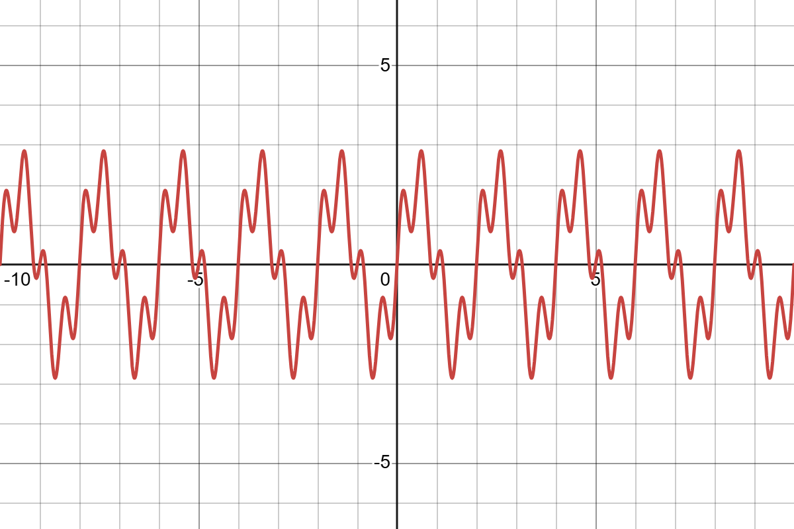
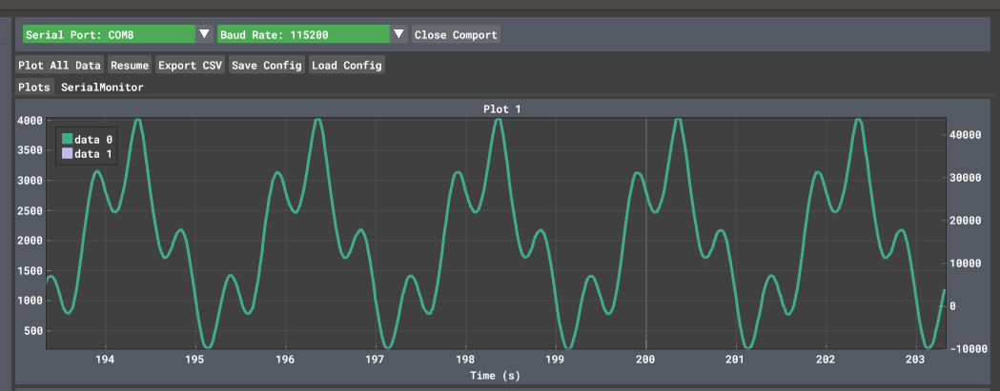
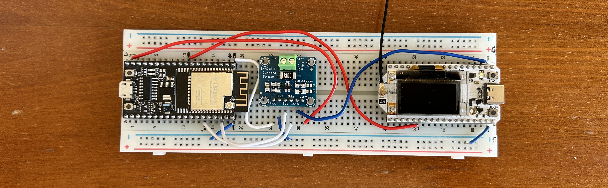
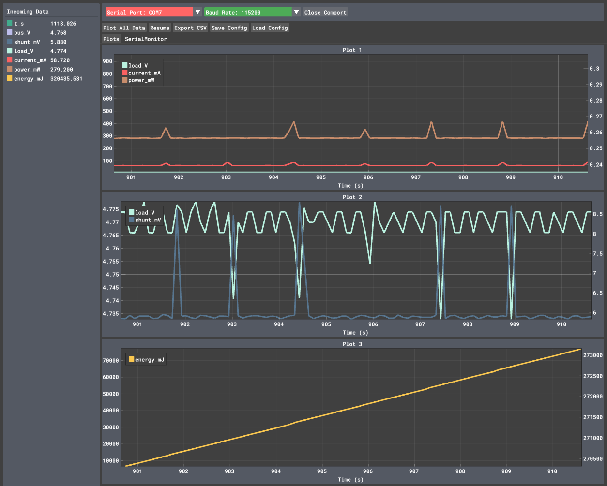
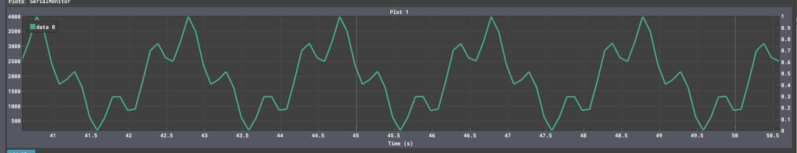

# IoT_individual_assignment
Repo for all the code of the individual assignment for the IoT course
by Filippo Zanei

# Structure of the repo
All the main.cpp have been uploaded here as .txt files, in order to reproduce correctly all the experiments I suggest to create in PlatformIO 3 different projects: one for the signal generator and INA219 [main.cpp](/generator-main-INA219-final.txt), one for the maximum sampling frequency and one for the receiver, which works also as the transmitter to the MQTT broker. (correct links are still to be updated, but all the files are here).

## Setup and fondamentals
In order to achieve all the tasks required for the exercise, we need at least one ESP32 with a LoRa antenna, a signal generator that simulates the signal a potential sensor would send to the ESP32, that can be another ESP32 or a computer (potentially one ESP32 can be enough if it has boh DAC and ACD on board, but our Heltech ESP3-V3 was lacking of the DAC, futhermore to correctly simulate the sensor signal, doing it directly on the same device that is also receiving and analysing it is not really rapresentative of the reality we want simulate, expecially reguarding power consumption).  
In our specific case we ended up using a ESP32 from AZ-Delivery, equipped only with the WiFi but with both DAC and ADC, as the signal generator, while we used the Heltech one as the receiver and analyser. This one is also the one that will transmit all the aggregated data to the servers.  
Before starting with the task, we have to validate a functional set up with the hardare at my disposal. As said before, I had:
* 1 ESP32 from AZ-Delivery, used as the signal generator and data sampler from the INA219;
* 1 Heltec ESP32-V3, capable both of WiFi and LoRa communication, used as the receiver and transmitter.

We started with the following basic configuration, and tried to test if the generator is able to correctly recreate the chosen waveform, which is $y(t) = 2 sin (2pi0.5t) + sin(2pi2t)$.  

As can be seen from the pictures, the generated waveform corresponds to the theorical one and this proves that in the simplier set up both the generator and the receiver perform correctly their tasks.
The first problem we encountered with this set up came once we tried to implement in the circuit the INA219 to do energy consumption measurements. Indeed, from the previous configuration, the Heltec ESP32 is powered via the usb port, which makes impossible to put correctly in series the INA219 to measure its consuptions. With the hardware at our disposal, there was no solution to get other sources of power to the Heltec, so we tried something "experimental": why don't we treat the Heltec as if it was a sensor connected to the AZ-Delivery ESP32 and then get the energy directly from it? In theory it should work, and as we will se in this repo, for a while it worked, but once we reached more hungry tasks this was not enought and we had to stop. So, the cofiguration we ended up is the following:  

  

In this configuration we are basically powering all the set up via the generator, powering the INA219 trough the 3.3V pin and the Heltec via the 5V pin, which has the INA219 in series to get the energy measurements for the operations on the Heltec. The configuration worked and we had coherent results in the power measurements, as we can see in the following plots:

  

So, now that we have proven the base functionality of the set up, we can proceed with the main tasks of the individual assignment.  
## Task1: max sampling frequency
For this task we created a stand alone firmware to stress the Heltech ESP32 via sampling using the analogRead() function, as it will be used in the next steps of the exercise. The idea is simple: we count as many samples the ESP32 is able to take in a certain time and with those information we calculate the sampling rate, aka the sampling frequency. In order to get the exact frequency we measure also the exact time interval that is used in total to sample inside the theoretical window of sampling, which gives us the frequency with the following formula  
$$f_{s,max} = \frac{N of samples}{t_f - t_i}. $$  
From repeated experiments we found a $f_{s,max} \sim 16454 Hz$, with oscillations between $\sim 16448 Hz$ and $\sim 16455 Hz$.

## Task2: adapting via FFT the sampling rate
Knowing the waveforme that we are generating, we know from the Nysquit theorem that in order to sample the signal without loosing any information we need a sampling frequency $f_s$ at least bigger then 2 times the highest component of the signal, which we will call $f_m$, giving us the formula $f_s > 2 f_m$. With the aim of reducing the energy consumption, we use FFT to get the $f_m$ from our entry signal and then reduce the samping frequency to and arbitrary $f_s = 2.5 f_$, just to be extra safe when we have to sample signals with very small frequency and still get a good amount of data. Furthermore, under suggestion from chatGPT, which helped building the code for the whole exercise, we have added a lowerlimit of $f_s = 10 Hz$ to the sampling in order to keep enough samples to have a recognizable waveform in the reconstruction, as we can see in the plots below.  

  

As we can see from the data in the table, the ftt performed well and we where able to adjust the $f_s$, but we were not able to test the reduction of power consumption due to a problem with the whole set up which is discussed later in the README.

##Task3: Aggregate function and sending to the MQTT server

##Problems with the energy forniture to the Heltec in the INA219 configuration
