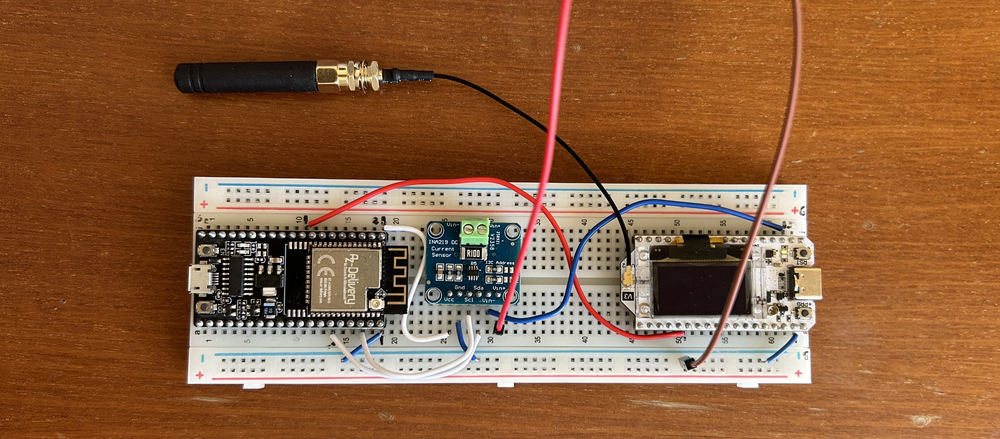

# IoT_individual_assignment
Repo for all the code of the individual assignment for the IoT course
by Filippo Zanei

# Structure of the repo
All the final firmware used in the assignment is organized in 4 folders: [max_sampling_speed](/max_sampling_speed/) contains the firmware to experimentally count the max sampling frequency obtainable on the ESP32 in use, [sinewave_generator](/sinewave_generator/) containst the firmware for the AZ-Delivery ESP32 for generating the signal and receiving the data of the powermeasures from the INA219, [receiver_individual_assignment](/receiver_individual_assignment/) contains the firmware of the Heltec ESP32 which transmits the aggregated data of the mean of the signal via wifi and [heltec-test-lora](/heltec-test-lora/) contains the firmware of the Hletec ESP32 which transmits the aggregated data of the mean of the signal via LoRaWAN.  
The other .txt files contains various data and previous modifications of the main.cpp files of the firmwares.

## Setup and fondamentals
In order to achieve all the tasks required for the exercise, we need at least one ESP32 with a LoRa antenna, a signal generator that simulates the signal a potential sensor would send to the ESP32, that can be another ESP32 or a computer (potentially one ESP32 can be enough if it has boh DAC and ACD on board, but our Heltech ESP3-V3 was lacking of the DAC, futhermore to correctly simulate the sensor signal, doing it directly on the same device that is also receiving and analysing it is not really rapresentative of the reality we want simulate, expecially reguarding power consumption).  
In our specific case we ended up using a ESP32 from AZ-Delivery, equipped only with the WiFi but with both DAC and ADC, as the signal generator, while we used the Heltech one as the receiver and analyser. This one is also the one that will transmit all the aggregated data to the servers.  
Before starting with the task, we have to validate a functional set up with the hardare at my disposal. As said before, I had:
* 1 ESP32 from AZ-Delivery, used as the signal generator and data sampler from the INA219;
* 1 INA219;
* 1 Heltec ESP32-V3, capable both of WiFi and LoRa communication, used as the receiver and transmitter;
* breadboard and cables from a devkit;
* modified charger for delivering 5V 2A DC current to the Heltec board (added at the end).


We started with the following basic configuration, and tried to test if the generator is able to correctly recreate the chosen waveform, which is $y(t) = 2 sin (2pi0.5t) + sin(2pi2t)$.  


As can be seen from the pictures, the generated waveform corresponds to the theorical one and this proves that in the simplier set up both the generator and the receiver perform correctly their tasks.
The first problem we encountered with this set up came once we tried to implement in the circuit the INA219 to do energy consumption measurements. Indeed, from the previous configuration, the Heltec ESP32 is powered via the usb port, which makes impossible to put correctly in series the INA219 to measure its consuptions. With the hardware at our disposal, there was no solution to get other sources of power to the Heltec, so we tried something "experimental": why don't we treat the Heltec as if it was a sensor connected to the AZ-Delivery ESP32 and then get the energy directly from it? In theory it should work, and as we will se in this repo, and for a while it worked, but once we reached more power demanding tasks this was not enought and we had to stop. So, the configuration we ended up is the following:  

  

In this configuration we are basically powering all the set up via the generator ESP32, powering the INA219 trough the 3.3V pin and the Heltec via the 5V pin, which has the INA219 in series to get the energy measurements for the operations on the Heltec. The configuration worked and we had coherent results in the power measurements, proving the validity of this setup, as we can see in the following plots:

  

So, now that we have proven the base functionality of the set up, we can proceed with the main tasks of the individual assignment, which were done until there was the implementation of the communications via WiFi and LoRa, that made the whole sistem to fail, wich made impossible to measure the energy consumption with the INA219.  
To solve this problem, we had to use another source of power for the Heltec ESP32. So we use the modified charger to deliver the current via the 5V pin instead of the usb port, as we can see in the following setup photo:  

  

In this way we were able to complete the other tasks and correctly measure, through the INA219, the power consumption of the Heltec board not only while sampling, but also when WiFi and LoRa connection were enabled.  


## Task1: max sampling frequency
For this task we created a stand alone firmware ([max_sampling_speed](/max_sampling_speed/)) to stress the Heltech ESP32 via sampling using the analogRead() function, as it will be used in the next steps of the exercise. The idea is simple: we count as many samples the ESP32 is able to take in a certain time and with those information we calculate the sampling rate, aka the sampling frequency. In order to get the exact frequency we measure also the exact time interval that is used in total to sample inside the theoretical window of sampling, which gives us the frequency with the following formula  

$$f_{s,max} = \frac{N of samples}{t_f - t_i}. $$  

From repeated experiments we found a $f_{s,max} \sim 16454 Hz$, with oscillations between $\sim 16448 Hz$ and $\sim 16455 Hz$.

## Task2: adapting via FFT the sampling rate
Knowing the waveform that we are generating, we know from the Nysquit theorem that in order to sample the signal without loosing any information we need a sampling frequency $f_s$ at least bigger then 2 times the highest component of the signal, which we will call $f_m$, giving us the formula $f_s > 2 f_m$, that in our case means findind a $f_s > 4Hz$.    
Assuming that an higher sampling frequency consumes more energy then a smaller one, and with the aim of reducing the energy consumption, we use FFT to get the $f_m$ from our entry signal and then reduce the samping frequency to and arbitrary $f_s = 2.5 \cdot f_m$, just to be extra safe when we have to sample signals with very small frequency and still get a good amount of data. 
From the following data, we can see that the FFT had performed correctly, changing the $f_s$ from the standard $50Hz$ to $5.13Hz$, which is circa 2.5 times the highest frequency of the signal ($f_m = 2Hz$):

```
iot/heltec/status connessione con heltec riuscita
iot/heltec/aggregate {"mean":1987.88,"min":215,"max":4020,"n":51,"fs":5.13}
```

To understand if this procedure is really giving us a reduction of power consumpion, we decide to measure with the INA219 the power consumption of 4 scenarios, with different $f_s$ of 5Hz, 50Hz, 100Hz and 1000Hz. The measured data is collected in the following table while the full data collection can be found in the [data folder](/data/):  

<div align="center">
|$f_s$              |5 Hz	 |50Hz	|1kHz |10kHz|
|-------------------|------|------|------|------|
|avg FFT (mW)       |00    |00    |00    |00    |
|avg sampling (mW)  |00    |00    |00    |00    |
</div>

<p align="center">
  
  <br>
  <em>Plot of the power consumption vs time of the receiver sampling at 5Hz</em>
</p>

<p align="center">
  
  <br>
  <em>Plot of the power consumption vs time of the receiver sampling at 50Hz</em>
</p>

<p align="center">
  
  <br>
  <em>Plot of the power consumption vs time of the receiver sampling at 1kHz</em>
</p>

<p align="center">
  
  <br>
  <em>Plot of the power consumption vs time of the receiver sampling at 10kHz</em>
</p>


**

*

*$*

As we can see from the data in the table and the pictures, we can clearly see where the FFT is being computed and that only when we push the $f_s$ to 1000Hz the average power consumption of the ESP32 is significantly higher then for the other frequencies.


Furthermore, since the measurements didn't show relevant differences in energy consumption between $f_s$ values under $100Hz$, we decided to add a lowerlimit frequency for the $f_s$ in the FFT, of $10 Hz$ (as shown in the picture) or somethimes of $20Hz$ for better resolution, to the sampling in order to keep enough samples to have a recognizable waveform in the reconstruction, under suggestion from chatGPT, which helped building the code for the whole exercise, we have added a lowerlimit frequency for the $f_s$ of $f_s = 10 Hz$ to the sampling in order to keep enough samples to have a recognizable waveform in the reconstruction, as we can see in the plots below.  

  

## Task3: Aggregate function and sending to the MQTT server
Since the configuration with the INA219 blocks the direct connection to the pc with the usb cable, we first tried to create the connection to the pc via the Mosquitto broker, which gave many problems due to privacy settings of the pc but with some help from chatGPT we were able to give it permission to give access to all devices connected to the same wifi network.  

The information sended to the MQTT broker could have been the raw data, but to make the task lighter, the data sended are a sequence of aggregated data: first the mean voltage measured over a windows of 10s, then for comparison the minimum and maximum voltage values measured in the window, followed by the number of points measured and the sampling rate $f_s$ chosen by the FFT, which is constant 20Hz since the lowerlimit was raised due to the bad waveform recunstructed from the 10Hz experiment.  
Following, the printed data from the pc terminal, of some of the pakages sent from this configuration:  

iot/heltec/status connessione con heltec riuscita  
iot/heltec/aggregate {"mean":1960.56,"min":179,"max":4043,"n":200,"fs":20.00}  
iot/heltec/aggregate {"mean":1960.16,"min":175,"max":4053,"n":201,"fs":20.00}  
iot/heltec/aggregate {"mean":1962.19,"min":175,"max":4043,"n":200,"fs":20.00}  
iot/heltec/aggregate {"mean":1961.03,"min":178,"max":4041,"n":200,"fs":20.00}  
iot/heltec/aggregate {"mean":1961.26,"min":175,"max":4043,"n":200,"fs":20.00}  
iot/heltec/aggregate {"mean":1961.71,"min":179,"max":4051,"n":200,"fs":20.00}  
iot/heltec/aggregate {"mean":1962.08,"min":173,"max":4044,"n":200,"fs":20.00}  

## Problems with the energy forniture to the Heltec in the INA219 configuration
